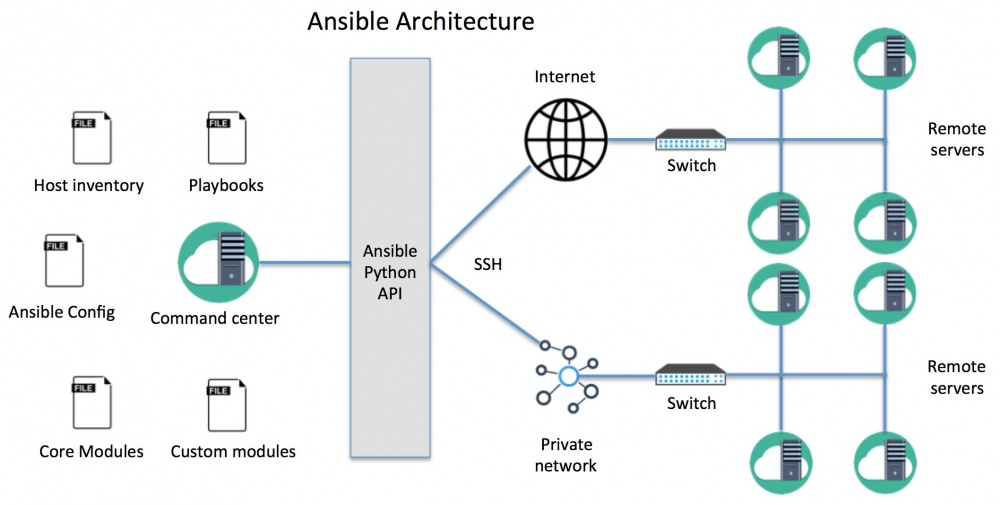

# Ansible

Для автоматизации настройки сборочных нод, установки и обновления ПО применяются роли Ansible.


## Как работает Ansible
Основная идея Ansible – наличие одного или нескольких управляющих серверов, из которых вы можете отправлять команды или наборы последовательных инструкций (playbooks) на удаленные сервера, подключаясь к ним по SSH.


В качестве управляющего сервера проще всего использовать сервер под управлением linux.

Для установки, на управляющем сервере введите:
```
sudo apt-add-repository ppa:ansible/ansible
sudo apt-get update
sudo apt-get install ansible
sudo apt-get install python-pip git libffi-dev libssl-dev -y
pip install pywinrm

```

Также можно воспользоваться vagrant.

```
vagrant up
vagrant ssh
cd /vagrant
```


TODO Набор файлов для Ansible
```
ansible.cfg - главный конфиг файл
inventory - файл с перечислением управляемых хостов
logs - каталог с логами выполнения задач
modules - каталог модулей
playbooks - каталог с плейбуками
playbooks\tasks - каталог с отдельными задачами
packadges - каталог для пакетов 1с
```


TODO либо как создавать ключи, либо как подложить уже существующие
Также необходимо сгенерировать на управляющем сервере ключ, который будет использоваться для доступа к настраиваемым серверам. 
Это делается с помощью команды
```
ssh-keygen
```

На все вопросы можно просто нажать Enter.

Теперь необходимо скопировать публичный ключ на настраиваемые сервера.

Это можно сделать с помощью утилиты ssh-copy-id с управляющего сервера Ansible для каждого настраиваемого сервера:
```
ssh-copy-id hostname|ip-adress
```

Для управления windows нодами ansible использует WinRM. Соответственно его необходимо корректно настроить.


Проверим что есть связь
```
ansible test1 -m ping
```

Проверим плейбук
```
ansible-playbook playbooks/setup_web1c.yml --check
```

И применим его
```
ansible-playbook playbooks/setup_web1c.yml
```
